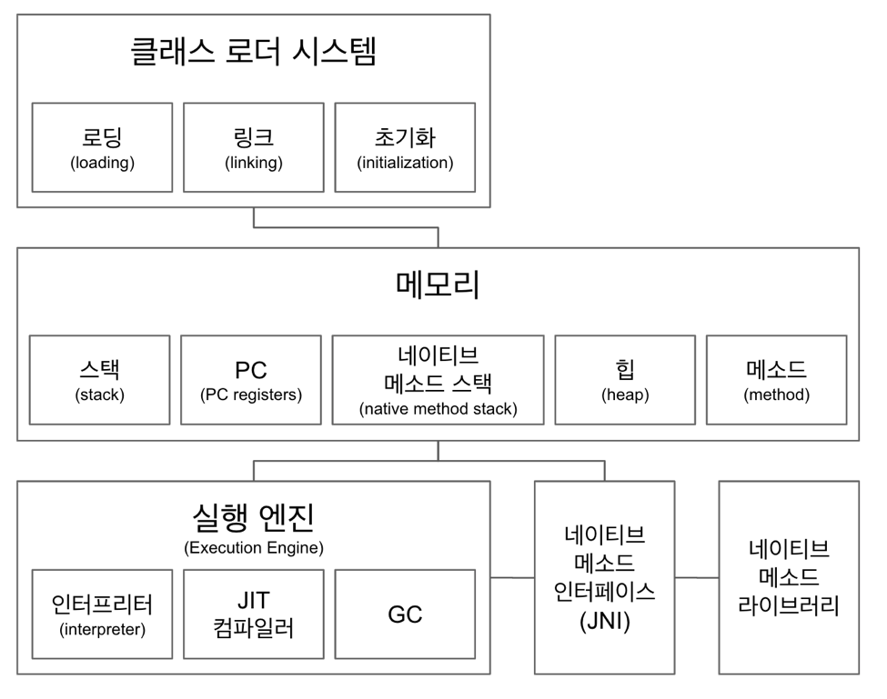

# 더 자바, 코드를 조작하는 다양한 방법

https://www.inflearn.com/course/the-java-code-manipulation#

다음의 내용은 `더 자바, 코드를 조작하는 다양한 방법`를 보고 주관적으로 간략하게 정리한 내용입니다. 제대로된 학습을 원하신다면 강의 수강을 권장해 드립니다.

---

##  섹션 0. JVM 이해하기 

## `0.1. 강좌 문서`

* [링크](더%20자바,%20코드를%20조작하는%20다양한%20방법.pdf)

## `0.2. 자바, JVM, JDK 그리고 JRE`

* JVM, JDK, JRE 이것들이 뭔지, 어떻게 다른건지를 이해하는 것이 이 강좌의 목표이다.

### JVM(Java Virtual Machine)

* 자바 바이트 코드를 어떻게 실행할지에 대한 내용을 담고 있는 표준 스펙이다.
* 자바 바이트 코드를 OS에 특화된 코드로 변환하고 실행하는 구현체이다.
* 자바 바이트 코드는 자바 소스파일을 javac XXX.java를 통해 컴파일을 거치면서 XXX.class가 나오게 되는데 이 안에 들어있는 코드를 가르킨다.
* 자바 바이트 코드는 인터프리터와 JIT 컴파일러를 통해 머신코드로 변경된다음 실행된다.
* 클래스 파일을 읽고 머신코드로 변경하고 메모리에 올리고 실행하는 역할을 한다.
* JVM은 스펙으로 여러 밴더에 따라 구현체가 다를 수 있다. 즉 여러 밴더의 JVM이 있을 수 있다.
* JVM의 구현체는 다양하고 각 네이티브 OS에 맞춰서 실행되어야 하기 때문에 플랫폼에 종속적이다.
* JVM은 홀로 제공되지 않고 최소한의 배포단위인 JRE 형태로 배포된다.

### JRE(Java Runtime Environment)

* JRE 배포판의 목적은 자바 애플리케이션을 실행하는 것이다.
* JRE 안에는 바이트 코드를 실행하기 위해 당연히 JVM이 필요하고 자바의 핵심 라이브러리(rt.jar, characterset.jar, propertysettings 파일 등등)가 포함된다.
* 자바 애플리케이션을 개발하는데 필요한 것들(javac 등등)은 제공되지 않는다.

### JDK(Java Development Kit)

* JDK 안에는 JRE와 개발에 필요한 툴들이 포함된다.
* 오라클은 자바 11부터 JDK만 제공하며 JRE를 제공하지 않지만 9부터 들어온 모듈 시스템의 jlink를 통해 자신만의 JRE를 만들어 사용할 수 있다.
* JVM 자체는 class 파일만 필요하기 때문에 꼭 자바가 아니더라도 class 파일을 만들 수 있는 클로저, 그루비, JRuby, Jython, Kotlin, Scala 등등의 다른 언어를 사용해 개발해도 아무런 상관이 없다.

## `0.3. JVM 구조`

## `0.4. 클래스 로더`

---

<!-- ## 섹션 1. 바이트코드 조작

### 1. 코드 커버리지는 어떻게 측정할까?

### 2. 모자에서 토끼를 꺼내는 마술

### 3. javaagent 실습

### 4. 바이트코드 조작 정리

---

## 섹션 2. 리플렉션

### 1. 스프링 Dependency Injection은 어떻게 동작할까?

### 2. 리플렉션 API 1부: 클래스 정보 조회

### 3. 애노테이션과 리플렉션

### 4. 리플렉션 API 2부: 클래스 정보 수정 또는 실행

### 5. 나만의 DI 프레임워크 만들기

### 6. 리플렉션 정리

---

## 섹션 3. 다이나믹 프록시

### 1. 스프링 데이터 JPA는 어떻게 동작할까?

### 2. 프록시 패턴

### 3. 다이나믹 프록시 실습

### 4. 클래스의 프록시가 필요하다면?

### 5. 다이나믹 프록시 정리

---

## 섹션 4. 애노테이션 프로세서

### 1. 롬복(ProjectLombok)은 어떻게 동작할까?

### 2. 애노테이션 프로세서 실습 1부

### 3. 애노테이션 프로세서 실습 2부

### 4. 애노테이션 프로세서 정리

### 5. 마무리 -->
